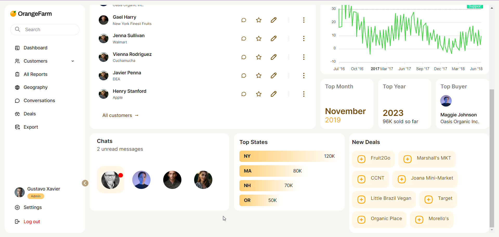

# Toshiba Dashboard Task (Done ✅)
by [Manish Kumar Das](https://github.com/the-halfbloodprince)

## How to check the deployed site
Here's the link to the deployed project on vercel: https://toshiba-task-dashboard-frontend.vercel.app/

## Screenshots

## How to access the code
This is a repo with two submodules in it.
- One is for the backend code. Not much in there, except for the downsampling algo.
- Second is the frontend code.

The `README`s of the corresponding repos (backend and frontend) will be updated asap.

## How to locally run the app
- Clone the two repositories separately
- Follow the instructions on the respective repos' `README`s for clear steps

## Document on how to locally run the code
Here's a document about the same too: https://docs.google.com/document/d/1260EMJsgGD-iagJCJgXD8kixedka6WODZmS82dx9-Kg/edit?usp=sharing

## The task
[x] - Replicate the UI
[x] - Downsampling the data
  - I was new to it and thanks to this task, I actually read an article or two about it and came to know about the algos generally used, such as Largest Triangle 1 bucket, 3 buckets and dynamic methods. I have included the code for 3 buckets but it wasn't completely my own, I was already running short on time.
[x] - Responsive
[x] - Sidebar can be expanded and closed as well
[x] - All colors properly picked up and used using CSS Variables
[x] - There's almost no color arbitratily used, everything's picked from Figma

There are a few inaccuracies still in the project which arised due to some libraries I was using, some tools, and some methodologies like using CSS Grid all throughout.

Here are a few screenshots of the project:
- The app
  - 
  - 
  - 
  - 
  - 

- Collapsed sidebar
  - 
  - 

- Button to toggle show or close sidebar
  - 

- Interactive Chart
  - 
  - 

- Responsiveness:
  due to time limitations and workload, I only went with one additional screen size.
  - 
  - 
  - 

